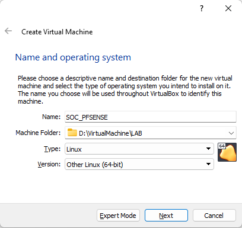
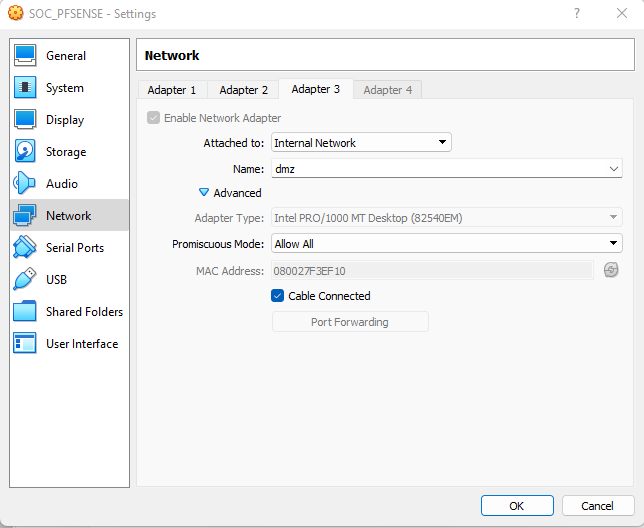

- [DOWNLOAD](#download)
- [VIRTUALBOX SETTING](#virtualbox-setting)
- [INSTALLATION](#installation)
- [CONFIGURATION](#configuration)

# DOWNLOAD
* Go to the [official site](https://www.pfsense.org/download/)
* Download the last stable version of the community edition

# VIRTUALBOX SETTING
* Create a new virtual machine

* Go to the VM properties
* In Network tab, activate 3 adapters
  * Used a paper to note the MAC ADDRESS of each cards, it can be usefull for future actions.

This will be the RED CARD (external network)

This will be the GREEN CARD (internal network)

This will be the orange CARD (dmz)

* Launch the VM
  * It will ask you wich ISO Virtualbox must mount on the VM, load the pfsense one.

# INSTALLATION
* Accept the copyright

* Select "install"
  

* Select your keymap
* Use the default partition (we're in a lab, we just need a firewall)
* Proceed with installation (no miror, no encrypt, nothing)
* Waiting

* Don't load manual configuration

* Reboot on the new system

# CONFIGURATION

Now, the server is power on with the new system

* Select 1 to configure interfaces

_Here, you can see the MAC ADDRESS and understand why i tell you to remember them.

* Select the RED INTERFACE for WAN
* Select the GREEN INTERFACE for LAN
* Select the last one (ORANGEE) for DMZ

* Confirm

* Select 2 to confogure the IP address
* Left the WAN interface as DHCP
* Select 2 to change the LAN interface
* Give it the IP and subnet you want, *the gateway must be "none"* !