- [DOWNLOAD](#download)
- [VIRTUALBOX SETTING](#virtualbox-setting)
- [INSTALLATION OF WINDOWS](#installation-of-windows)
- [CONFIGURATION OF WINDOWS](#configuration-of-windows)
- [INSTALLATION OF ACTIVE DIRECTORY](#installation-of-active-directory)
- [CONFIGURATION OF ACTIVE DIRECTORY](#configuration-of-active-directory)

# DOWNLOAD
* Go to [Microsoft evalcenter](https://www.microsoft.com/fr-fr/evalcenter/evaluate-windows-server-2022)
* Select "Download the ISO file"
* You can give falses informations

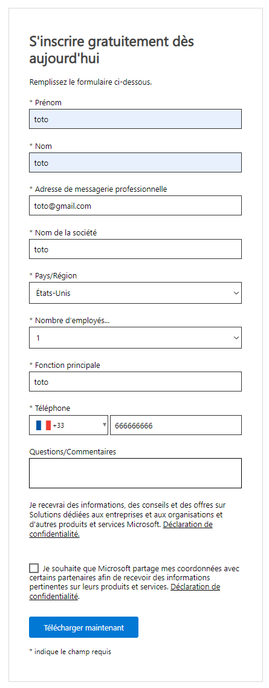

* Download the ISO in 64 bits in English

# VIRTUALBOX SETTING
* Create a new virtual machine

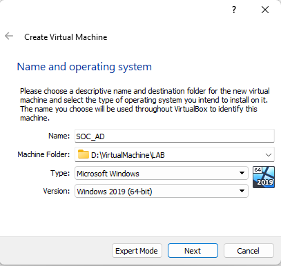
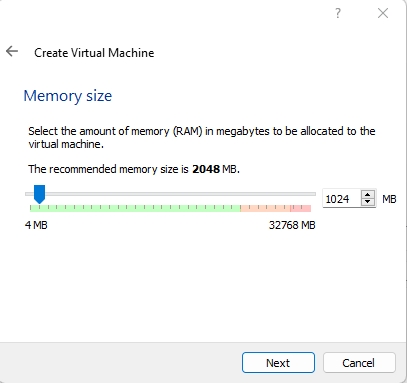
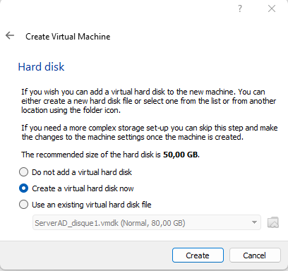
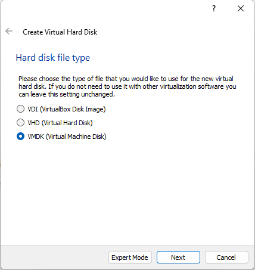
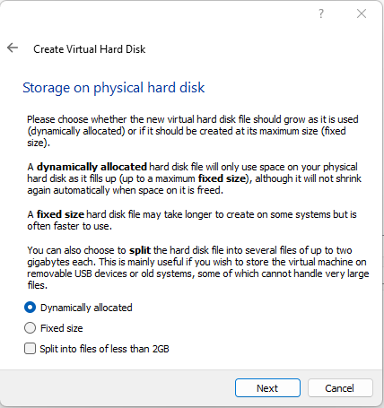
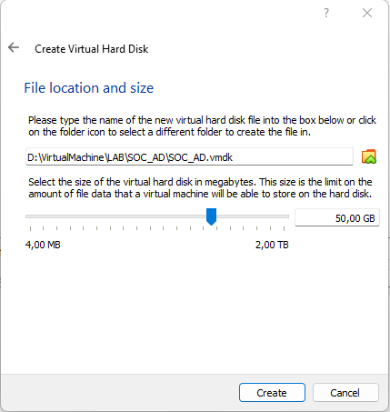

* Go to the VM properties
* In Network tab, change the configuration to use internal network : GREEN

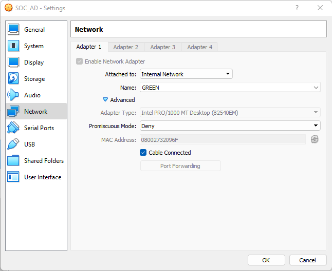

* Launch the VM
  * It will ask you wich ISO Virtualbox must mount on the VM, load the Windows Server one.

# INSTALLATION OF WINDOWS
* Select the English language to install.
  * The other setting can be adjust with your favorite configuration but in IT you must install Windows in English !

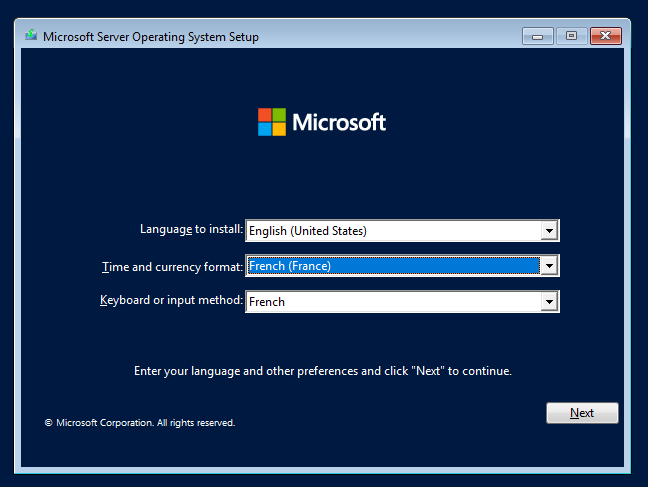

* Select "install now"
* Select "Windows Server 2022 Datacenter Evaluation (Desktop Experience)".
  * For a lab, the GUI can be usefull if you start your carrier in IT.

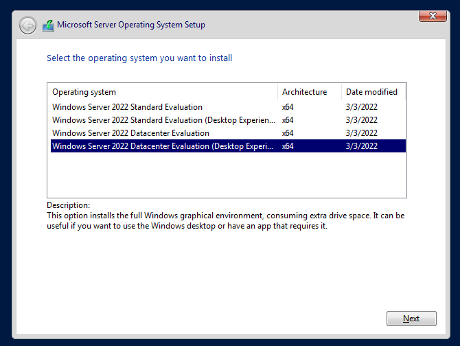

* Accept software licence
* Select Custom install

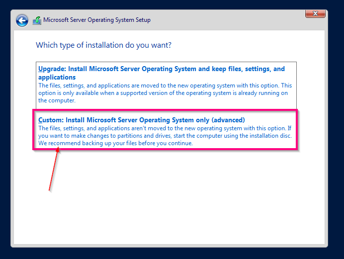

* Select the only drive mount and click "next"

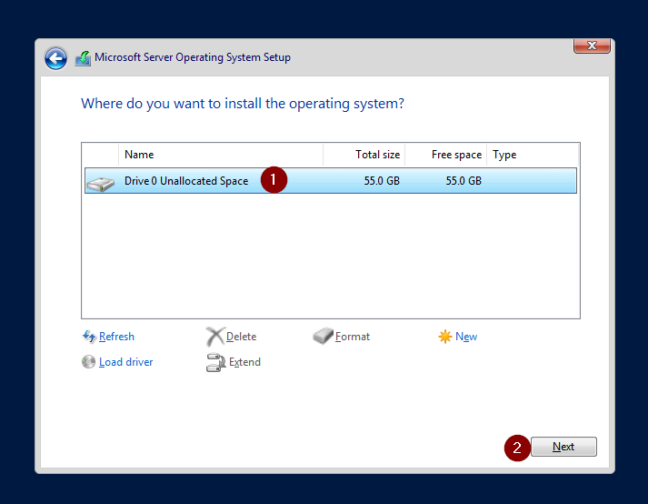

* Waiting for install and reboot
* Set your password (remember it's a lab, you can have a low password)

# CONFIGURATION OF WINDOWS
* Connect to your administrator account
* Go to "Open Network & Internet Setting"

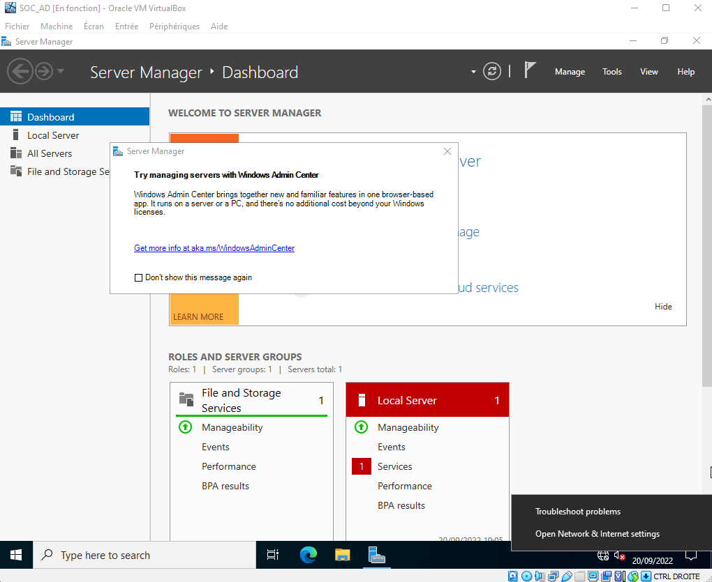

* Change adapter options

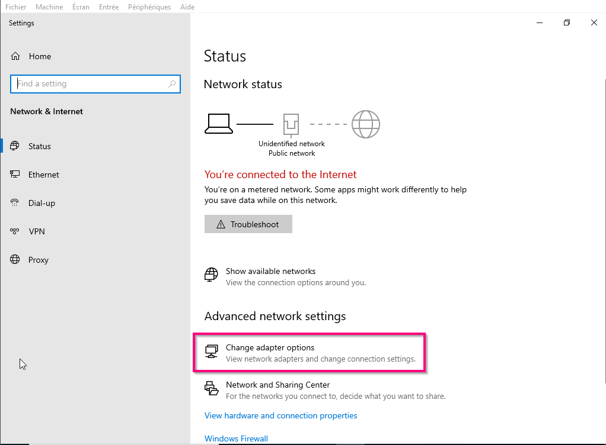

* Select your card properties
* Go to "Internet Protocol Version 4" > Properties

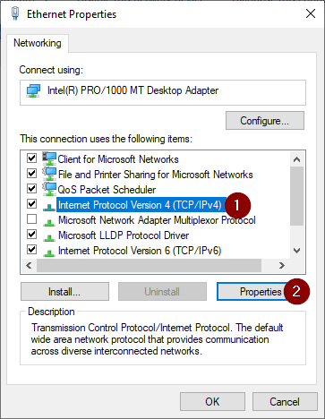

* Give IP

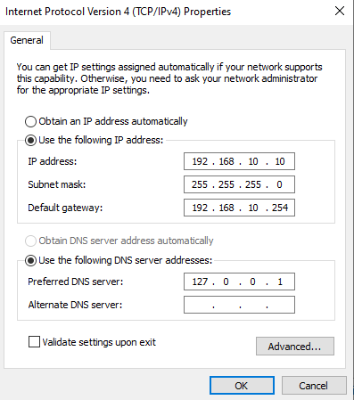

* Try to join the gateway (so your LAN INTERFACE in pfsense)

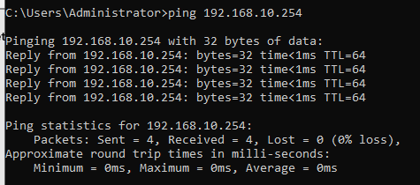

* Rename the server with a easy name to remember/use.

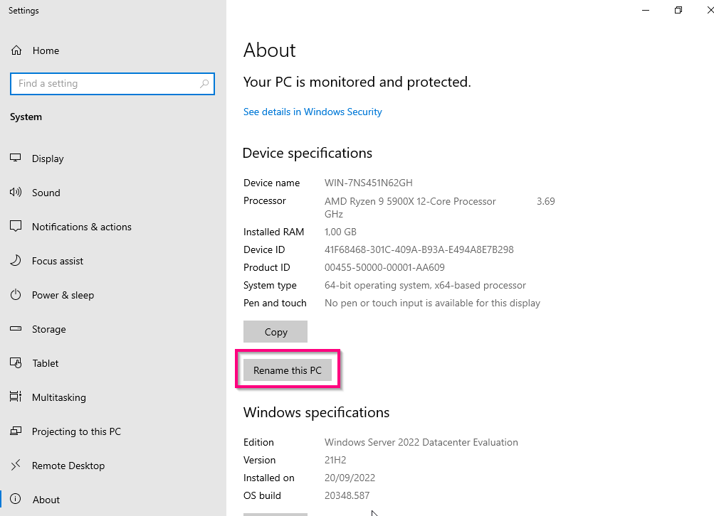
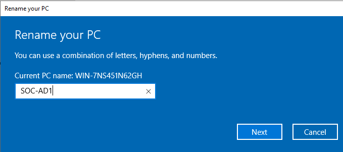

* Restart your VM

# INSTALLATION OF ACTIVE DIRECTORY
* Connect to your administrator account
* Select "Add roles and features"

* Add a role-based installation
* Select the only server you've got
* Add "Active Directory Domain Services"

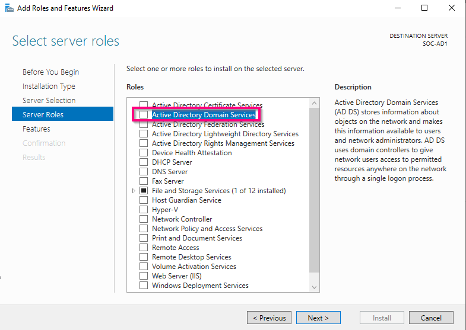
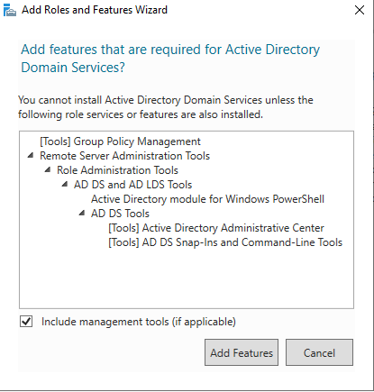

* Left the other windows with defaults configurations
* After it's finish, promote this server to a domain controller

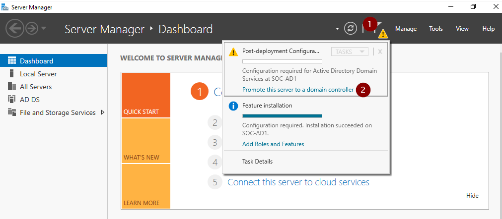

* Add a new forest
* 
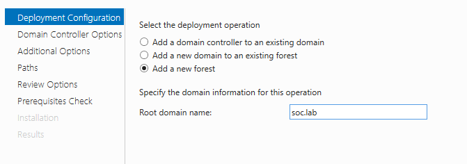

* Left default configuration and give a password

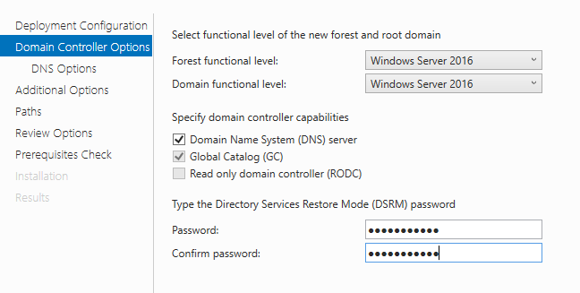

* Left DNS part by default
* Check the netbios domain name (this will give you want you will have to write before the \)
* Left the default path
* Launch the install
* Reboot when asked for it

# CONFIGURATION OF ACTIVE DIRECTORY
Now you have a Active Directory Server, you need to populate it with missconfiguration to perform analysis.
To do it easily, we gonna use [BadBloud](https://github.com/davidprowe/BadBlood)

* Download it on the AD
* Extract it
* Launch Powershell as administrator
* Go to Badblood folder
* Launch Invoke-BadBlood.ps1
* Let the magic happen (this can take several minutes)

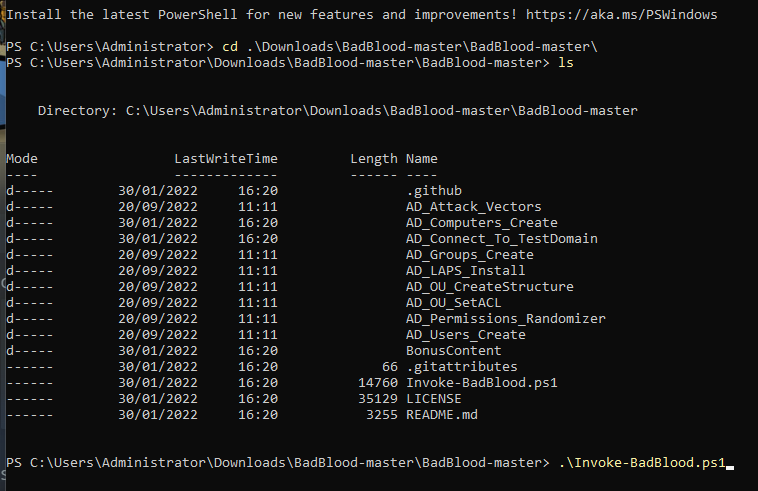
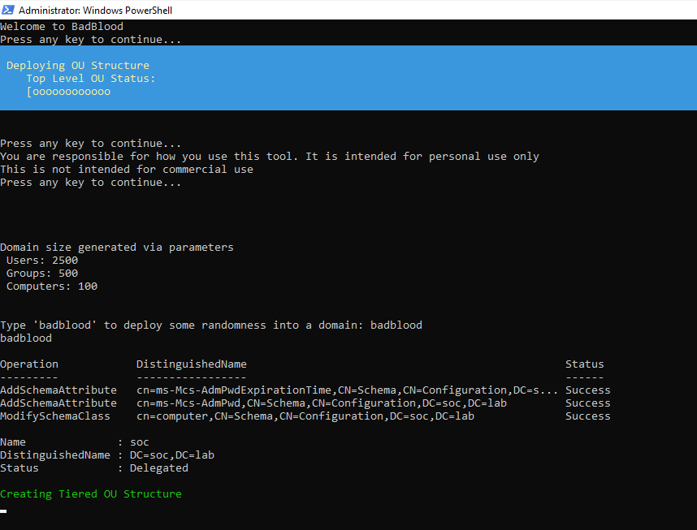

Now, you have a shitty Active Directory configuration (2500 users, 500 groups, OU, 100 computers, etc.), have fun !

