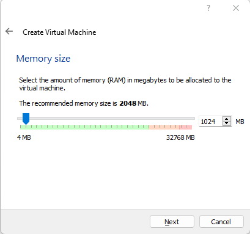

- [DOWNLOAD](#download)
- [VIRTUALBOX SETTING](#virtualbox-setting)
- [INSTALLATION OF WINDOWS](#installation-of-windows)
- [CONFIGURATION OF WINDOWS](#configuration-of-windows)
- [ADD YOUR WORKSTATION TO THE DOMAIN](#add-your-workstation-to-the-domain)

# DOWNLOAD
* Download the [tool offer by Microsoft](https://go.microsoft.com/fwlink/?LinkId=691209)
* Launch it
* Accept the software licence
* Select "create a installation support" to make an ISO
* Select the english language

* Select "ISO file"
* Save the file on your computer

# VIRTUALBOX SETTING
* Create a new virtual machine

* Go to the VM properties
* In Network tab, change the configuration to use internal network : GREEN

* Launch the VM
  * It will ask you wich ISO Virtualbox must mount on the VM, load the Windows Server one.

# INSTALLATION OF WINDOWS
* Select the English language to install.
  * The other setting can be adjust with your favorite configuration but in IT you must install Windows in English !

* Select "install now"
* Select "i don't have a product key" (or enter the one you have)

* Select Windows 10 Pro version

* Accept the license terms
* Select a custom install

* Select the only drive you have and select "Next"

* Waiting for install and reboot
* Select your region
* Select your keyboard layout
* Select "I don't have internet" in the left bottom corner

* Select " Continue with limited setup" in the left bottom corner

* Give a name and password to your local account
* Answer the three security questions
* Set all other options to the minimale value (no location, no track, etc.)

# CONFIGURATION OF WINDOWS
* Connect to your administrator account
* Go to "Open Network & Internet Setting"
* Change adapter options
* Select your card properties
* Go to "Internet Protocol Version 4" > Properties
* 

* Give IP

* Try to join the gateway (so your LAN INTERFACE in pfsense)

* Rename the server with a easy name to remember/use.

* Restart your VM

# ADD YOUR WORKSTATION TO THE DOMAIN
* Go to "Advanced system setting"
* Select "Change"

* Select "Domain" and give your netbios domain name
* Give your Administrator domain account credentials

* Reboot your VM