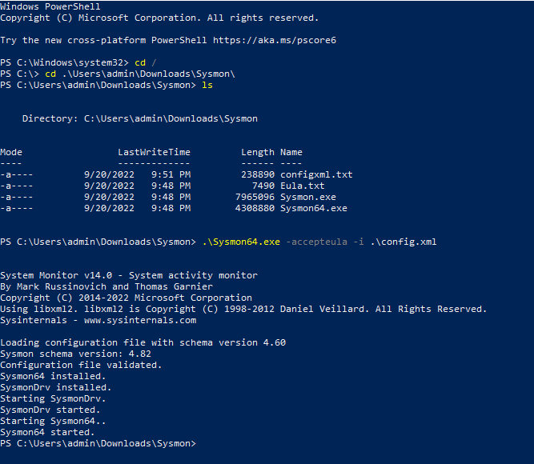

- [DOWNLOAD SYSMON](#download-sysmon)
- [DOWNLOAD THE CONFIGURATION FILE](#download-the-configuration-file)
- [INSTALL IT](#install-it)

**ALL STEP MUST BE DONE ON EACH WINDOWS OF YOUR LAB**

# DOWNLOAD SYSMON
* Go to [Windows Sysinternals page](https://learn.microsoft.com/fr-fr/sysinternals/downloads/sysmon)
* [Download Sysmon](https://download.sysinternals.com/files/Sysmon.zip)
* Extract it

# DOWNLOAD THE CONFIGURATION FILE
* Download the [xml file](https://github.com/olafhartong/sysmon-modular/blob/master/sysmonconfig.xml)
* Save it in the Sysmon's folder

# INSTALL IT
* Launch Powershell in administrator
* Install it with "sysmon.exe -accepteula -i YOURFILE.xml"

