- [ACCOUNT](#account)
- [INSTALL FOR LINUX](#install-for-linux)
- [INSTALL FOR WINDOWS](#install-for-windows)
- [ADVANCED INSTALL FOR WINDOWS](#advanced-install-for-windows)
# ACCOUNT
* Go to the [crowdsec site](https://www.crowdsec.net/)
* Select "create free account"
* Create the free account and log in to CrowdSec.

# INSTALL FOR LINUX
* When you're log in you have all informations to install it on linux.

# INSTALL FOR WINDOWS
* Go to the [GitHub page](https://github.com/crowdsecurity/crowdsec/releases/latest)
* Download the msi file on the Windows computer (server and workstation)
* Launch it

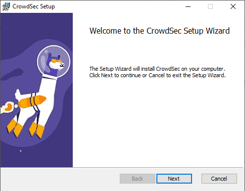
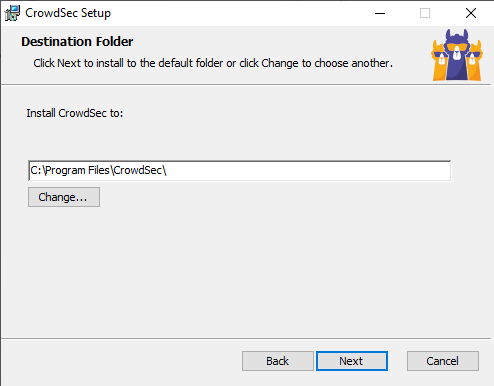
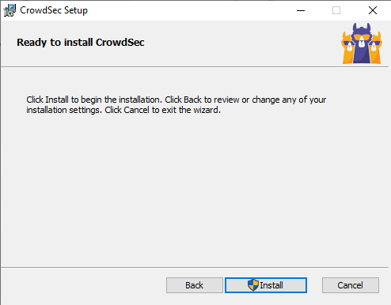

* Waiting

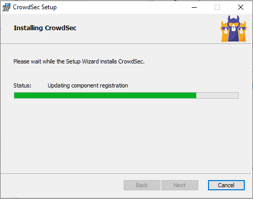
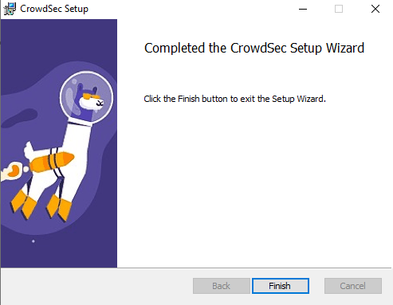

Contrary to Linux, CrowdSec does not yet support the automatic configuration at installation time. If you want to be able to detect something other than RDP or SMB bruteforce, then you will need to customize your acquisition configuration.

* Launch Powershell with administrator in CrodwSec's folder
* .\cscli collections install crowdsecurity/windows-firewall

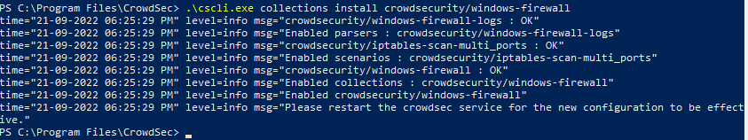

* Open the acquis.yaml file in "C:\ProgramData\CrowdSec\config\"
* Add this to it : 
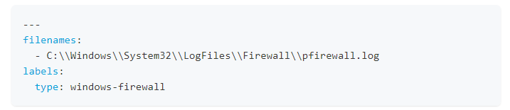

* Reboot the computer

# ADVANCED INSTALL FOR WINDOWS
If you want your Crowdsec can block you have to install the Windows Firewall Bouncer Installation.
* Go to the [dedicated page](https://github.com/crowdsecurity/cs-windows-firewall-bouncer/releases)
* Download the bundle file (contain all dependancies)
* Launch it

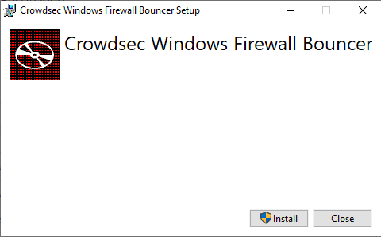

* Waiting

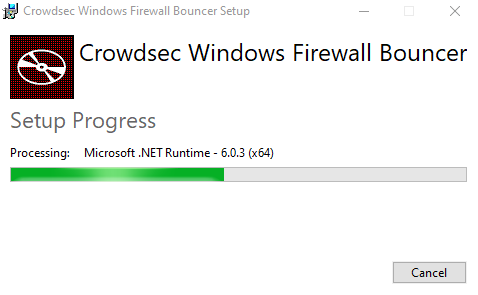
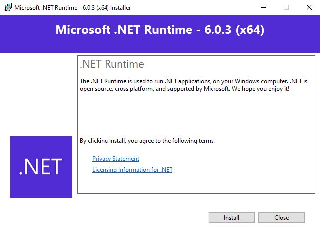
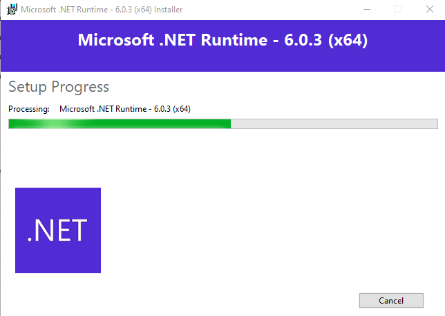
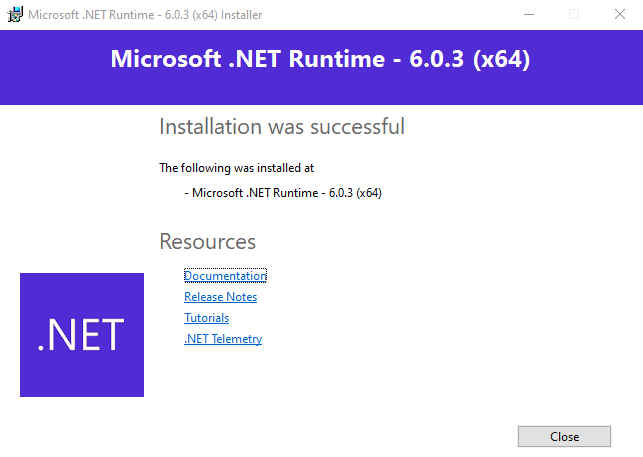
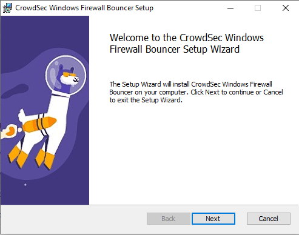
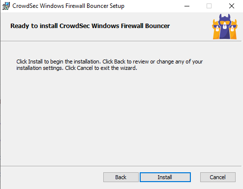

* Waiting

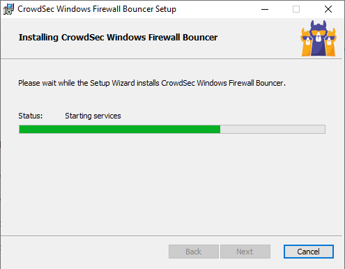
