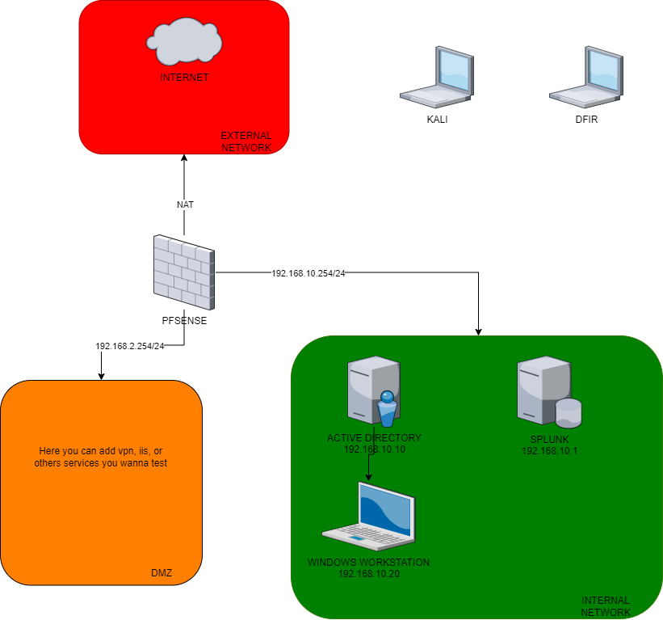

- [PURPOSE](#purpose)
- [SOFTWARES](#softwares)
  - [VIRTUALBOX](#virtualbox)
  - [PFSENSE](#pfsense)
  - [SPLUNK](#splunk)
    - [WHY SPLUNK ?](#why-splunk-)
  - [WINDOWS WORKSTATION](#windows-workstation)
  - [SYSMON](#sysmon)
  - [CROWDSEC](#crowdsec)
- [HOW TO READ THIS POST](#how-to-read-this-post)
- [DOCUMENTATIONS](#documentations)

# PURPOSE
In this article we gonna learn how to make a SOC lab.
The lab will contains : 
* 1 Active Directory
* 1 Windows Workstation
* 1 Splunk Server
* 1 firewall (pfsense)

# SOFTWARES
## VIRTUALBOX
To make all virtual machines we will used VirtualBox. It's available on all platform.
This software is easy to used and install so we don't gonna make a installation part.
[Link to download](https://www.virtualbox.org/wiki/Downloads)

On each vm I recommend the installation of the virtualbox guest add-on

## PFSENSE
pfSense is a free and open source firewall and router that also features unified threat management, load balancing, multi WAN, and more.

In this lab, we will seting a basic configuration.
[Link to download](https://www.pfsense.org/download/)

## SPLUNK
This software helps capture, index and correlate real-time data in a searchable repository, from which it can generate graphs, reports, alerts, dashboards and visualizations.
[Link to download](https://www.splunk.com/en_us/download/splunk-enterprise.html)

### WHY SPLUNK ?
It, for me, the easiest SIEM to deploy and maintain.

## WINDOWS WORKSTATION
We will used a Windows workstation joined in the domain because it will what you gonna see most of time.

## SYSMON
System Monitor (Sysmon) is a Windows system service and device driver that, once installed on a system, remains resident across system reboots to monitor and log system activity to the Windows event log.
[Link to download](https://learn.microsoft.com/fr-fr/sysinternals/downloads/sysmon)

## CROWDSEC
CrowdSec is an open-source and collaborative IPS (Intrusion Prevention System) and a security suite.
[Link](https://www.crowdsec.net)

# HOW TO READ THIS POST
We gonna install all of this in order, please read folder in order.

# DOCUMENTATIONS
[Crowdsec](https://docs.crowdsec.net/docs/intro)
[Crowdsec installation](https://doc.crowdsec.net/docs/getting_started/install_crowdsec/)
[Splunk Forwarder](https://docs.splunk.com/Documentation/Forwarder/7.2.4/Forwarder/InstallaWindowsuniversalforwarderfromaninstaller)
[Splunk autostart](https://docs.splunk.com/Documentation/Splunk/7.3.0/Admin/RunSplunkassystemdservice#Configure_systemd_using_enable_boot-start)
[Splunk ports requirments](https://community.splunk.com/t5/Deployment-Architecture/What-are-all-the-ports-to-be-opened-for-Splunk/m-p/415773)
[Splunk SSE](https://docs.splunksecurityessentials.com/content-detail/basic_brute_force/)