- [TELECHARGEMENT](#telechargement)
- [CONFIGURATION DE VIRTUALBOX](#configuration-de-virtualbox)
- [INSTALLATION](#installation)
- [CONFIGURATION](#configuration)

# TELECHARGEMENT
* Se rendre sur le [site officiel](https://www.pfsense.org/download/)
* Télécharger la dernière version stable, community edition

# CONFIGURATION DE VIRTUALBOX
* Créer une nouvelle VM

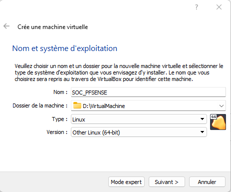
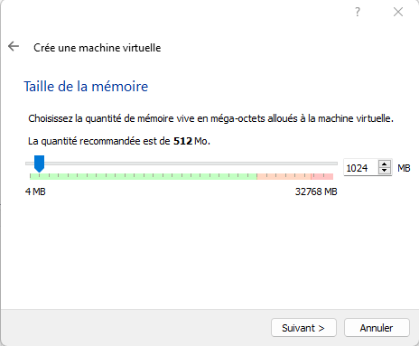
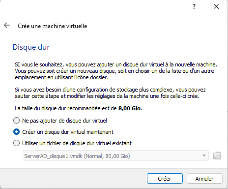
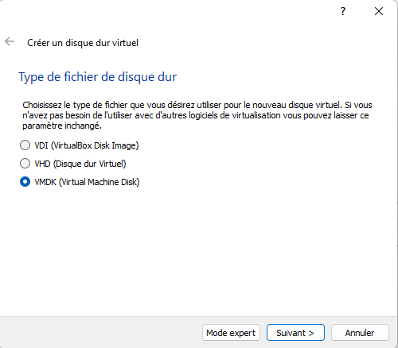
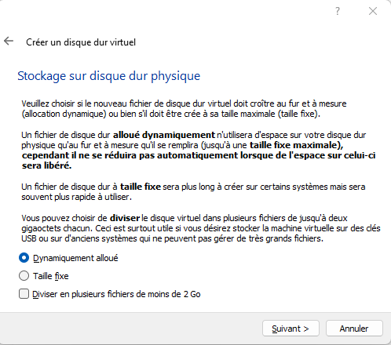
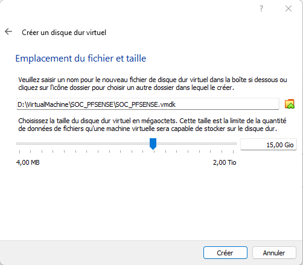

* Aller dans les propriétés de la VM
* Dans la partie réseau, activer les trois adaptateurs
  * Noter les adresses MAC sur un papier, ça servira plus tard.

Configuration de la zone rouge (réseau externe, hors entreprise)

Configuration de la zone verte (réseau interne à l'entreprise)

Configuration de la zone oranfz (DMZ)
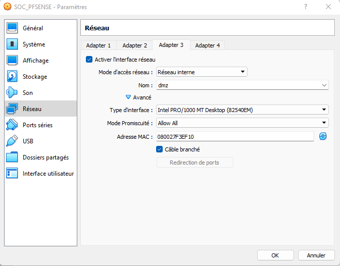

* Démarrer la VM
  * Monter l'ISO télécharger précédemment.

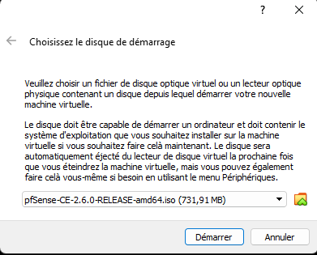

# INSTALLATION
* Accepter la licence
* 
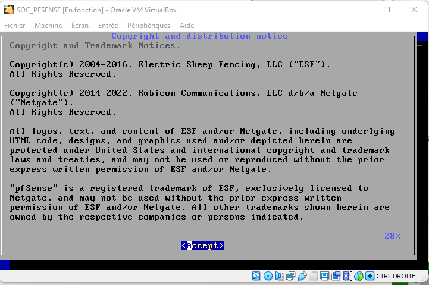

* Sélectionner "install"
  
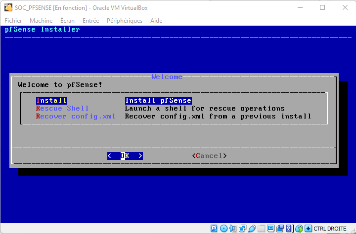

* Sélectionner votre clavier
* Laisser le partitionnement par défaut (on est dans un lab)
* Lancer l'installation (pas de raid ni chiffrement, rien)
* Patienter

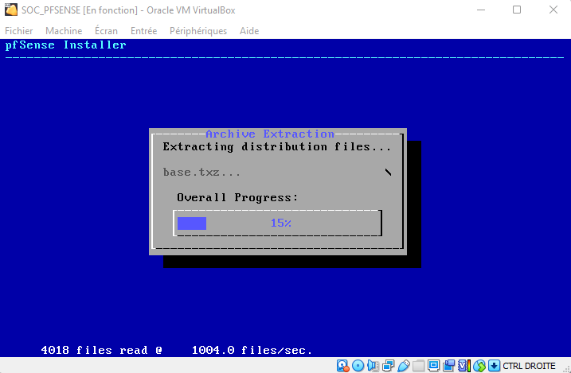

* Ne lancer pas la configuration manuelle
* 
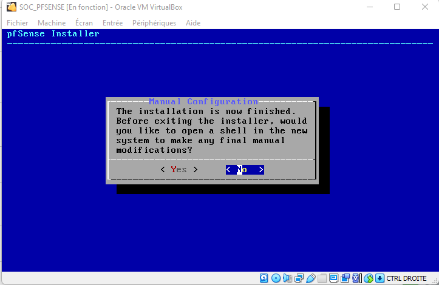

* Redémarrer la VM

# CONFIGURATION

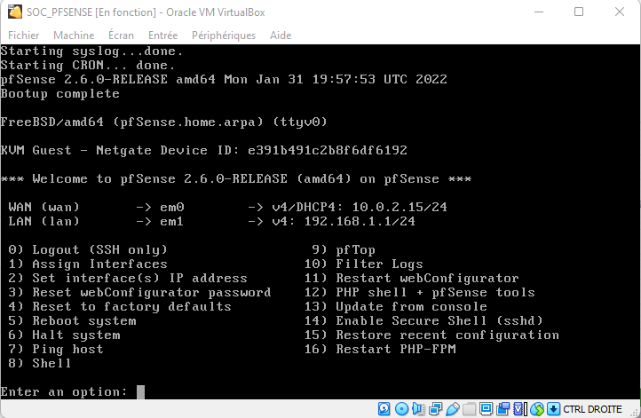

* Sélectionner 1 pour configurer les interfaces

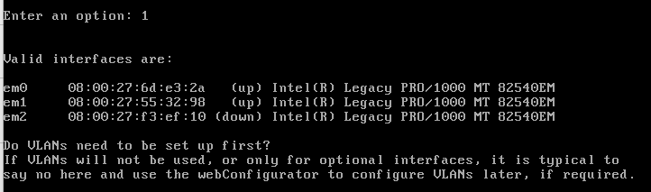

_Voici pourquoi il fallait noter les adresses MAC_.

* Sélectionner la carte avec la mac de la zone rouge pour la zone WAN
* Sélectionner la carte avec la mac de la zone verte pour la zone LAN
* Sélectionner la carte avec la mac de la zone orange pour la zone DMZ

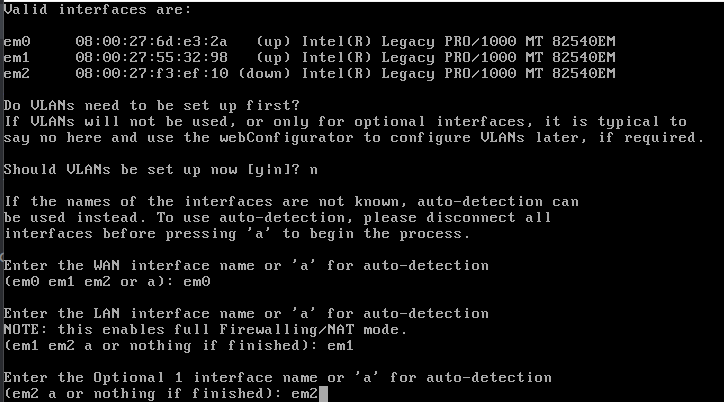

* Confirmer

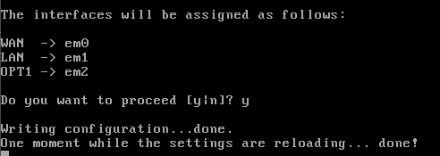

* Sélectionner 2 pour configurer les adresses IP
* Laisser l'interface WAN en DHCP
* Sélectionner 2 pour configurer l'interface LAN
* Configurer l'IP et le sous-réseau voulu (voir schéma précédent)

**Mettre "non" pour la passerelle**