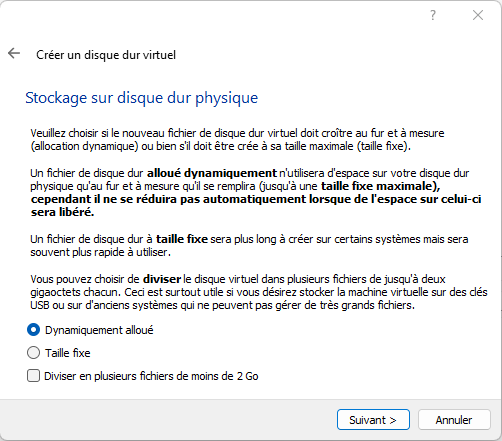

- [TELECHARGEMENT](#telechargement)
- [CONFIGURATION DE VIRTUALBOX](#configuration-de-virtualbox)
- [INSTALLATION DE WINDOWS](#installation-de-windows)
- [CONFIGURATION DE WINDOWS](#configuration-de-windows)
- [INSTALLATION D'ACTIVE DIRECTORY](#installation-dactive-directory)
- [CONFIGURATION DE ACTIVE DIRECTORY](#configuration-de-active-directory)

# TELECHARGEMENT
* Se rendre sur le [Microsoft evalcenter](https://www.microsoft.com/fr-fr/evalcenter/evaluate-windows-server-2022)
* Télécharger le fichier ISO
  * Vous pouvez mettre de fausses informations.
  * 

* Télécharger l'ISO in "64 bits English"

# CONFIGURATION DE VIRTUALBOX
* Créer une nouvelle VM

* Se rendre dans les propriétés de la VM
* Configurer la carte réseau en réseau interne : GREEN

* Démarrer la VM
  * Monter l'ISO Windows Server télécharger précédemment.

# INSTALLATION DE WINDOWS
* Installer en anglais-US.
  * Le reste peut être configurer comme vous voulez, mais toujours installer vos OS en anglais !

* Sélectionner "install now"
* Sélectionner "Windows Server 2022 Datacenter Evaluation (Desktop Experience)".
  * On est dans un lab, aucun jugement a installer la GUI.

* Accepter la licence
* Sélectionner Custom install

* Sélectionner votre seul disque

* Patienter durant l'installation et le redémarrage
* Configurer votre mot de passe (vous êtes dans un lab, Bonjour01 est valide ;) )

# CONFIGURATION DE WINDOWS
* Se connecter en administrator
* Vous rendre dans "Open Network & Internet Setting"

* Changer la configuration de l'adaptateur

* Sélectionner les propriétés de la carte
* Se rendre sur "Internet Protocol Version 4" > Properties

* Configurer l'IP

* Pinger votre passerelle (IP de LAN INTERFACE sur pfsense)

* Renommer le serveur .

* Redémarrer la VM

# INSTALLATION D'ACTIVE DIRECTORY
* Se connecter en administrator
* Sélectionner "Add roles and features"

* Sélectionner  role-based installation
* Sélectionner le seul serveur listé
* Sélectionner "Active Directory Domain Services"

* Laisser la configuration par défaut
* une fois l'installation finie, sélectionner "promote this server to a domain controller"

* Ajouter une nouvelle foret
* 

* Laisser la configuration par défaut et configurer un mot de passe simple (encore une fois, on est dans un lab)

* Laisser la configuration DNS par défaut
* Noter la partie "netbios domain name", il s'agit de ce qu'il faudra mettre avant le \ lors des connexions au domaine.
* Laisser les dossiers par défaut
* Lancer l'installation
* Redémarrer quand demandé

# CONFIGURATION DE ACTIVE DIRECTORY
Maintenant, il faut remplir votre AD avec des données, failles, etc. 
Pour le faire facielement, on va utiliser [BadBloud](https://github.com/davidprowe/BadBlood)

* Télécharger le sur votre AD
* Décompresser le fichier
* Exécuter Powershell en administrateur
* Naviguer jusqu'au dossier Badblood
* Exécuter Invoke-BadBlood.ps1
* Laisser la magie opérer !

