- [TELECHARGEMENT](#telechargement)
- [CONFIGURATION DE VIRTUALBOX](#configuration-de-virtualbox)
- [INSTALLATION OF WINDOWS](#installation-of-windows)
- [CONFIGURATION DE WINDOWS](#configuration-de-windows)
- [JOINDRE LA VM AU DOMAINE](#joindre-la-vm-au-domaine)

# TELECHARGEMENT
* Télécharger l'[outil fournit par Microsoft](https://go.microsoft.com/fwlink/?LinkId=691209)
* Exécuter le
* Accepte la licence d'utilisation
* Sélectionner "create a installation support" to make an ISO
* Sélectionner la langue anglaise

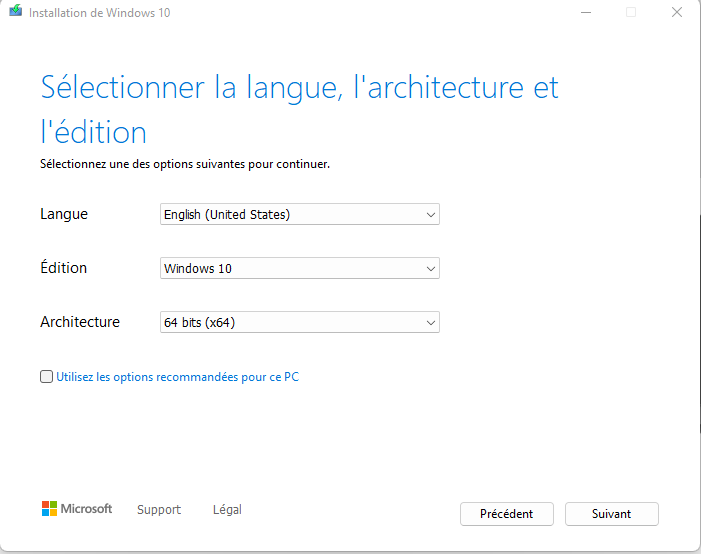

* Sélectionner "ISO file"
* Enregistrer le fichier sur votre poste

# CONFIGURATION DE VIRTUALBOX
* Créer une nouvelle VM

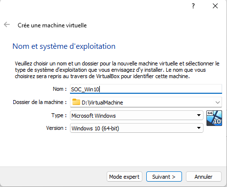
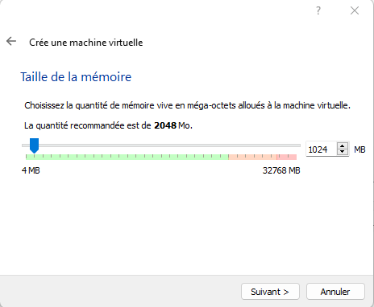
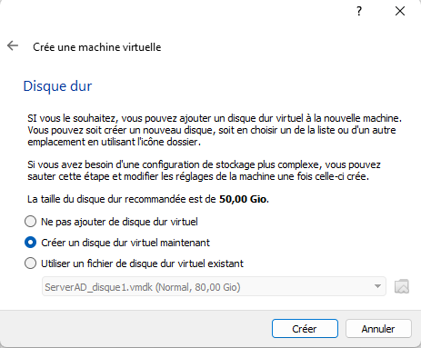
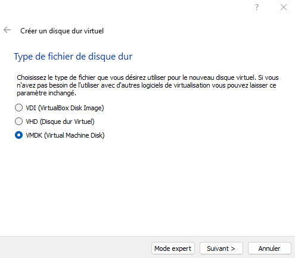
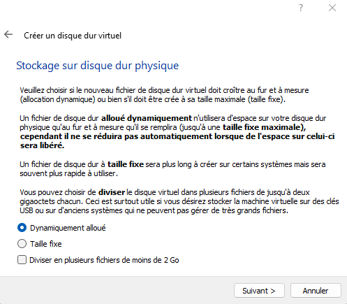
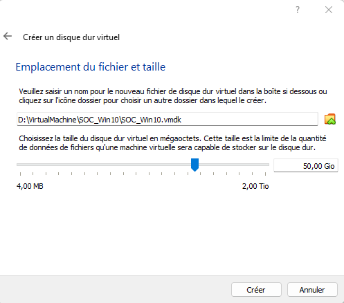

* Se rendre dans les propriétés de la VM
* Configurer l'adaptateur réseau en internal network : GREEN

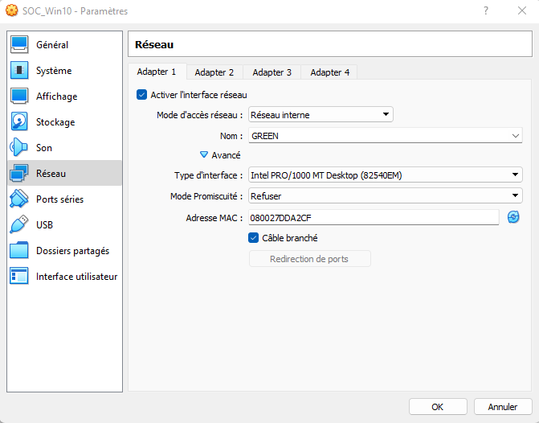

* Démarrer la VM
  * Monter l'ISO précédemment créé.

# INSTALLATION OF WINDOWS
* Installer en anglais-US.
  * Le reste peut être configurer comme vous voulez, mais toujours installer vos OS en anglais !

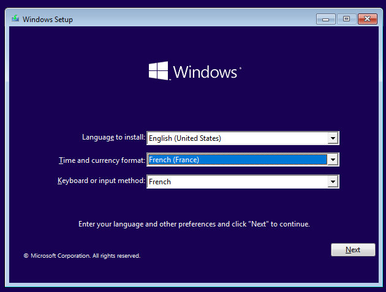

* Sélectionner "install now"
* Sélectionner "i don't have a product key" (or enter the one you have)

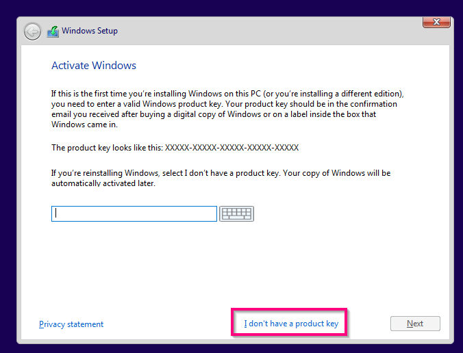

* Sélectionner Windows 10 Pro version

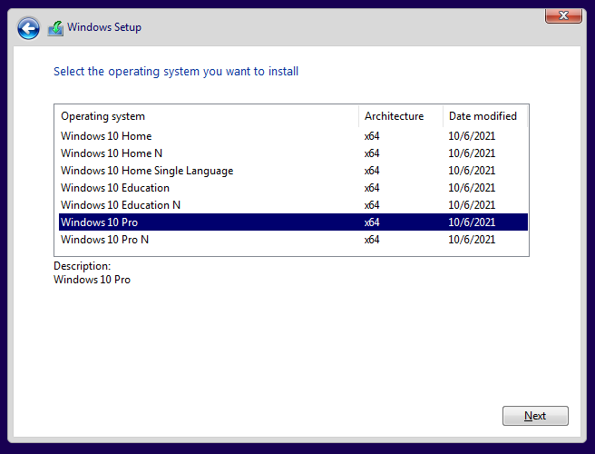

* Accepter la licence
* Sélectionner custom install

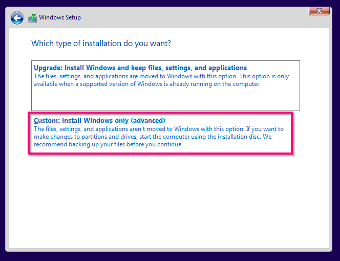

* Sélectionner le disque dur pour installation

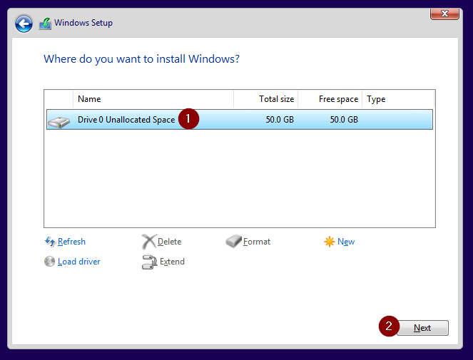

* Patienter durant l'installation et le redémarrage
* Sélectionner votre région
* Sélectionner votre clavier
* Sélectionner "I don't have internet" en bas à gauche

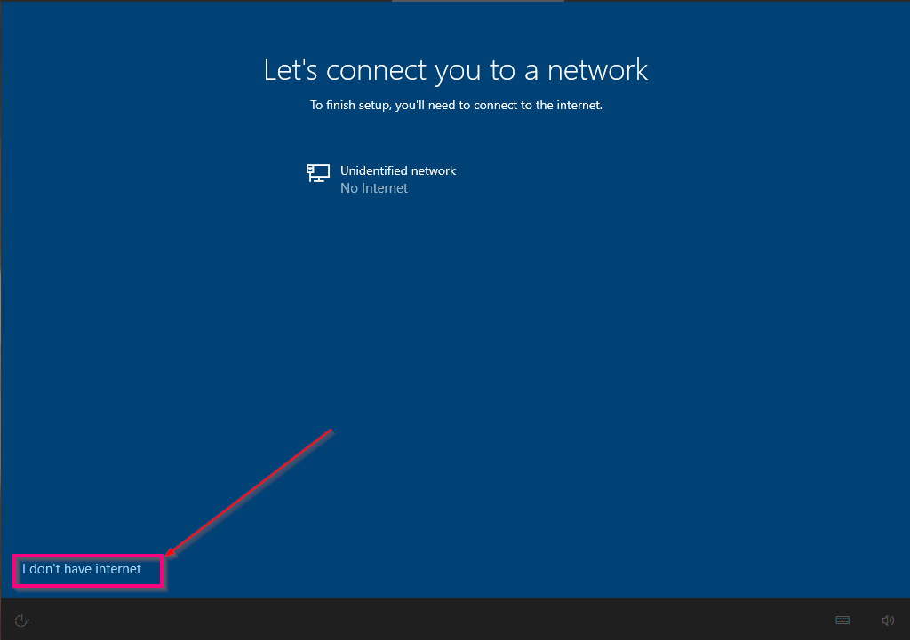

* Sélectionner " Continue with limited setup" en bas à gauche

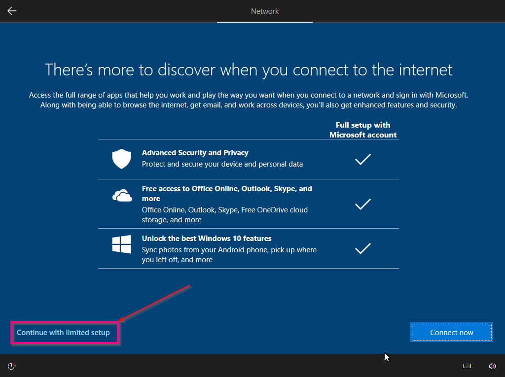

* Donner un nom et un mot de passe à votre compte local
* Répondre aux trois questions de sécurité
* Faite la configuration minimale (pas de géolocalisation, pas d'espionnage, etc.)

# CONFIGURATION DE WINDOWS
* Connectez-vous
* Se rendre dans "Open Network & Internet Setting"
* Changer la configuration de l'adaptateur
* Se rendre dans "Internet Protocol Version 4" > Properties
* 
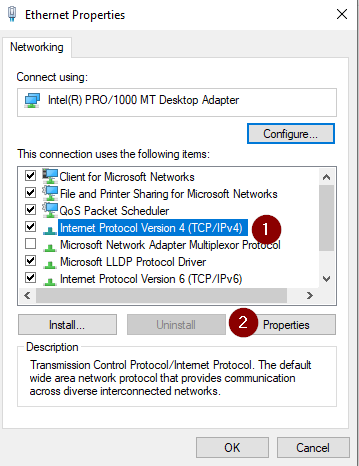

* Configurer l'IP

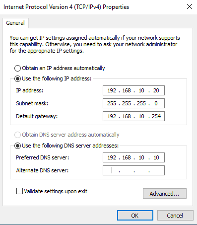

* Pinger votre passerelle (l'IP de LAN INTERFACE dans pfsense)

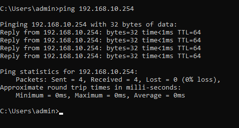

* Renommer votre machine.

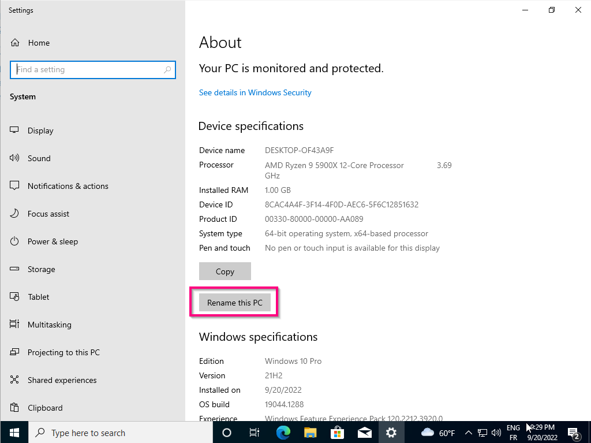
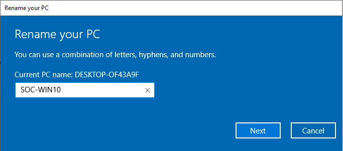

* Redémarrer la VM

# JOINDRE LA VM AU DOMAINE
* Se rendre dans "Advanced system setting"
* Sélectionner "Change"

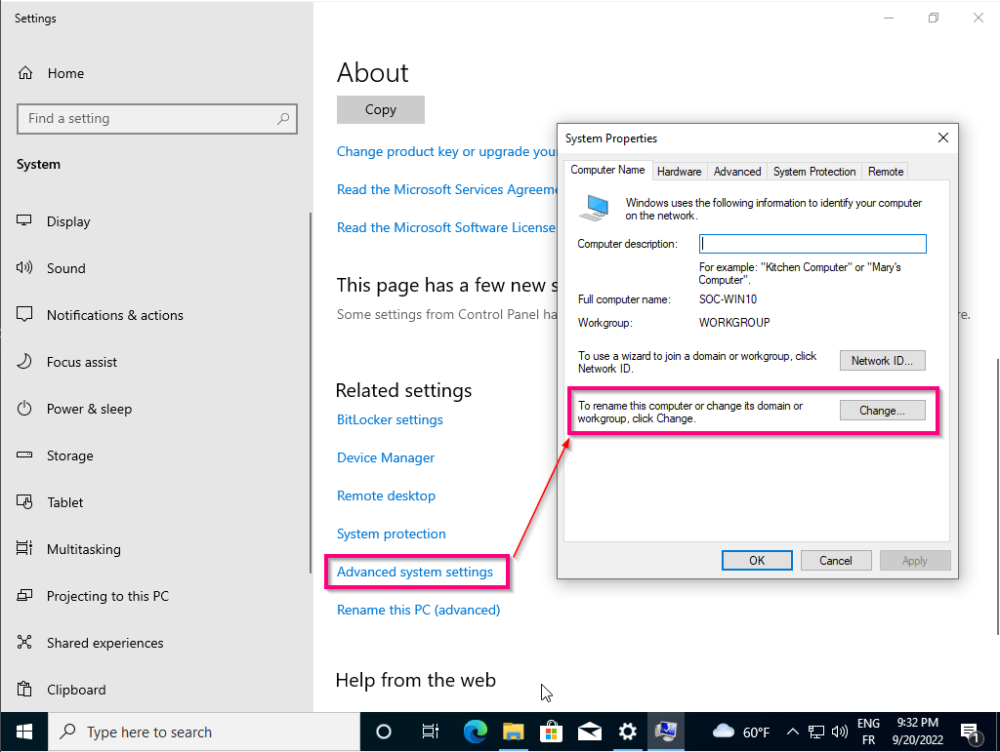

* Sélectionner "Domain" et configurer le nom netbios
* Renseigner le compte Administrator de votre AD

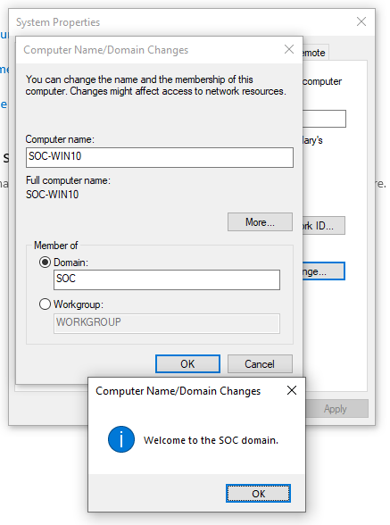

* Redémarrer