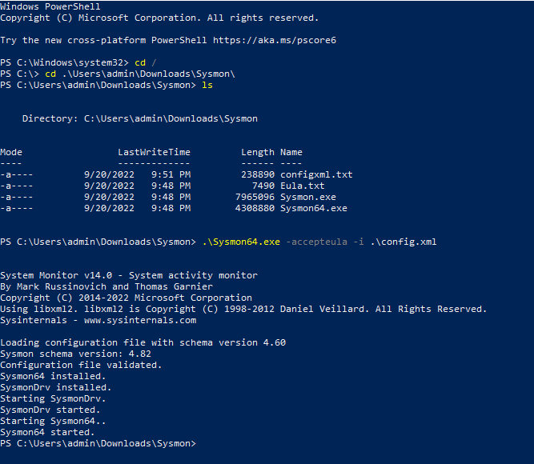

- [TELECHARGER SYSMON](#telecharger-sysmon)
- [tELECHARGER LE FICHIER DE CONFIGURATION](#telecharger-le-fichier-de-configuration)
- [INSTALLATION](#installation)

**A FAIRE SUR TOUS VOS WINDOWS**

# TELECHARGER SYSMON
* Se rendre sur le [Windows Sysinternals](https://learn.microsoft.com/fr-fr/sysinternals/downloads/sysmon)
* [Télécharger Sysmon](https://download.sysinternals.com/files/Sysmon.zip)
* Décompresser l'archive

# tELECHARGER LE FICHIER DE CONFIGURATION
* Télécharger le [fichier xml](https://github.com/olafhartong/sysmon-modular/blob/master/sysmonconfig.xml)
* Enregistrer le dans le dossier Sysmon

# INSTALLATION
* Exécuter Powershell en administrateur
* Saisir "sysmon.exe -accepteula -i YOURFILE.xml"

