- [ACCOUNT](#account)
- [INSTALL FOR LINUX](#install-for-linux)
- 
- 
- # COMPTE
* Se rendre sur le site de [crowdsec site](https://www.crowdsec.net/)
* Créer un compte
* Se connecter

# INSTALLATION POUR LINUX
* Une fois connecté, vous avez toutes les informations pour l'installer sur votre distribution Linux préférée.

# INSTALLATION POUR WINDOWS
* Se rendre sur la [page GitHub](https://github.com/crowdsecurity/crowdsec/releases/latest)
* Télécharger le fichier .msi sur votre VM
* Exécuter le.

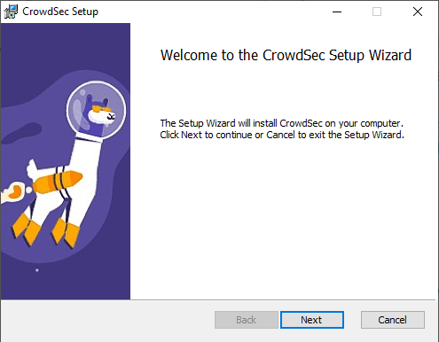
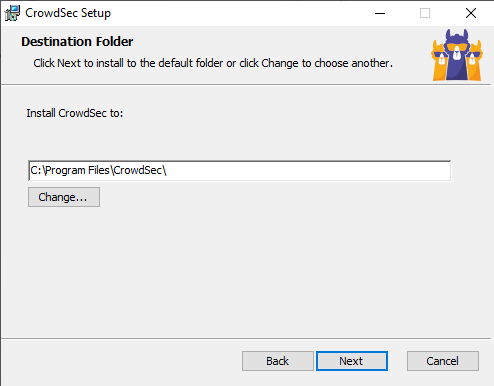
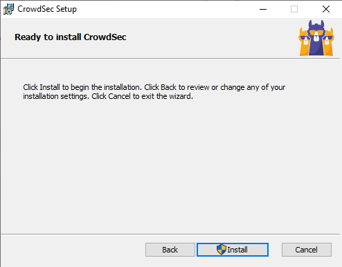

* Patienter

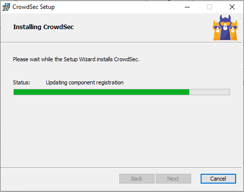
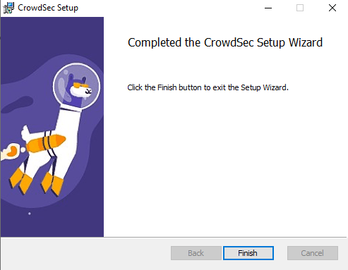

Contrairement à la version Linux, CrowdSec Windows ne supporte pas encore la configuration automatique au moment de l'installation. Si vous voulez être capable de détecter autre chose que le bruteforce RDP ou SMB, alors vous devrez personnaliser votre configuration d'acquisition.

* Exécuter Powershell en administrateur depuis le dossier CrowdSec
* .\cscli collections install crowdsecurity/windows-firewall

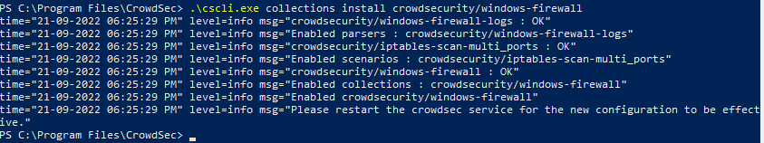

* Editer le fichier "acquis.yaml" dans "C:\ProgramData\CrowdSec\config\"
* Ajouter ceci : 
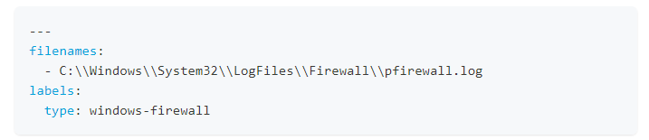

* Redémarrer le poste

# ADVANCED INSTALL FOR WINDOWS
Si vous voulez que CrowdSec ajoute automatiquement les règles de blocage à votre parefeu local il faut installer ""Windows Firewall Bouncer".
* Se rendre sur la [page dédiée](https://github.com/crowdsecurity/cs-windows-firewall-bouncer/releases)
* Télécharger le fichier bundle (contient tous les prérequis)
* Exécuter le.

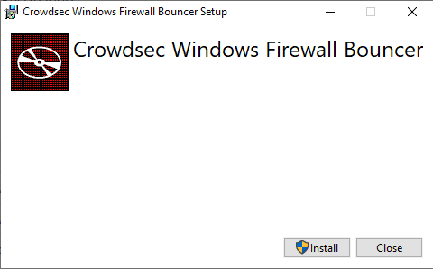

* Patienter

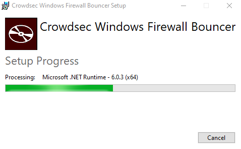
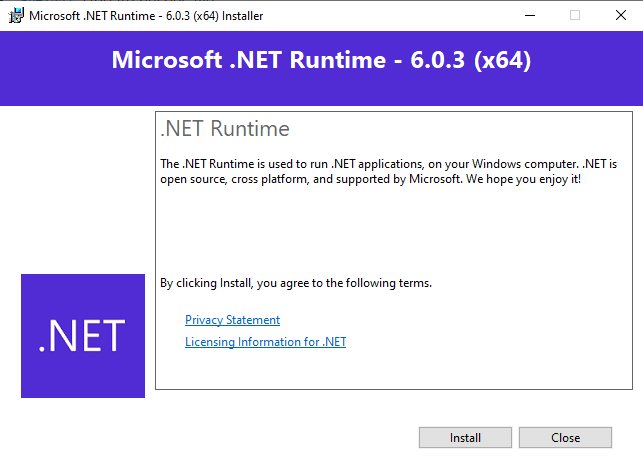
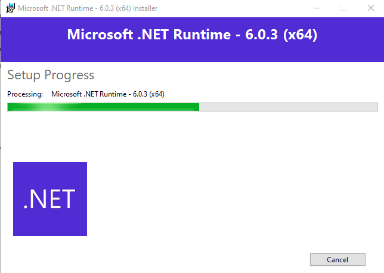
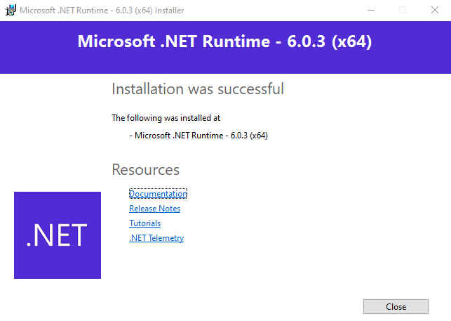
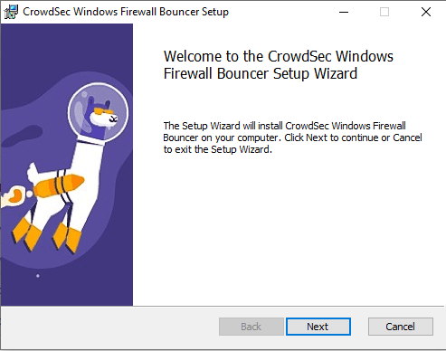
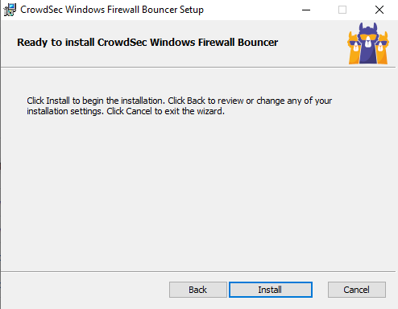

* Patienter

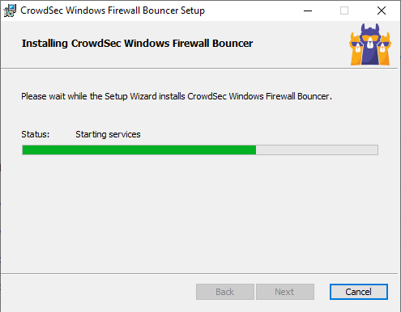

* Redémarrer