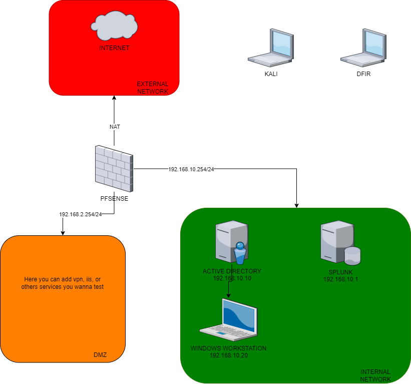

- [BUT](#but)
- [LOGICIELS](#logiciels)
  - [VIRTUALBOX](#virtualbox)
  - [PFSENSE](#pfsense)
  - [SPLUNK](#splunk)
    - [WHY SPLUNK ?](#why-splunk-)
  - [WINDOWS WORKSTATION](#windows-workstation)
  - [SYSMON](#sysmon)
  - [CROWDSEC](#crowdsec)
- [HOW TO READ THIS POST](#how-to-read-this-post)
- [DOCUMENTATIONS](#documentations)

# BUT
Guide pas-à-pas pour la création d'un lab dédiée à apprentissage des métiers du SOC.
Le lab est constitué de : 
* 1 Active Directory
* 1 Windows Workstation
* 1 SIEM (Splunk)
* 1 parefeu (pfsense)

# LOGICIELS
## VIRTUALBOX
Pour créer toutes les machines virtuelles, nous utiliserons VirtualBox. Il est disponible sur toutes les plateformes.
Ce logiciel est facile à utiliser et à installer, nous ne verrons donc pas son installation.
[Link to download](https://www.virtualbox.org/wiki/Downloads)

Je vous recommande d'installer les add-on invités sur chaque VM.

## PFSENSE
pfSense est un pare-feu et un routeur gratuit et open source qui offre également des fonctions de gestion unifiée des menaces, d'équilibrage de la charge, de multi WAN, etc.

[Link to download](https://www.pfsense.org/download/)

## SPLUNK
Ce logiciel permet de capturer, d'indexer et de corréler des données en temps réel dans un référentiel consultable, à partir duquel il peut générer des graphiques, des rapports, des alertes, des tableaux de bord et des visualisations. En gros, requêter vos logs et générer des alertes dessus.
[Link to download](https://www.splunk.com/en_us/download/splunk-enterprise.html)

### WHY SPLUNK ?
C'est, pour moi, le SIEM le plus facile à déployer et à maintenir dans un lab.

## WINDOWS WORKSTATION
Nous utiliserons une station de travail Windows jointe au domaine car c'est ce que vous verrez la plupart du temps.

## SYSMON
System Monitor (Sysmon) est un service système et un pilote de périphérique Windows qui, une fois installé sur un système, reste résident lors des redémarrages du système pour surveiller et enregistrer l'activité du système dans le journal des événements de Windows.
[Link to download](https://learn.microsoft.com/fr-fr/sysinternals/downloads/sysmon)

## CROWDSEC
CrowdSec est un IPS (Intrusion Prevention System) open-source.
[Link](https://www.crowdsec.net)

# HOW TO READ THIS POST
Nous allons installer tout cela dans l'ordre, veuillez lire le dossier dans l'ordre.

# DOCUMENTATIONS
[Crowdsec](https://docs.crowdsec.net/docs/intro)
[Crowdsec installation](https://doc.crowdsec.net/docs/getting_started/install_crowdsec/)
[Splunk Forwarder](https://docs.splunk.com/Documentation/Forwarder/7.2.4/Forwarder/InstallaWindowsuniversalforwarderfromaninstaller)
[Splunk autostart](https://docs.splunk.com/Documentation/Splunk/7.3.0/Admin/RunSplunkassystemdservice#Configure_systemd_using_enable_boot-start)
[Splunk ports requirments](https://community.splunk.com/t5/Deployment-Architecture/What-are-all-the-ports-to-be-opened-for-Splunk/m-p/415773)
[Splunk SSE](https://docs.splunksecurityessentials.com/content-detail/basic_brute_force/)